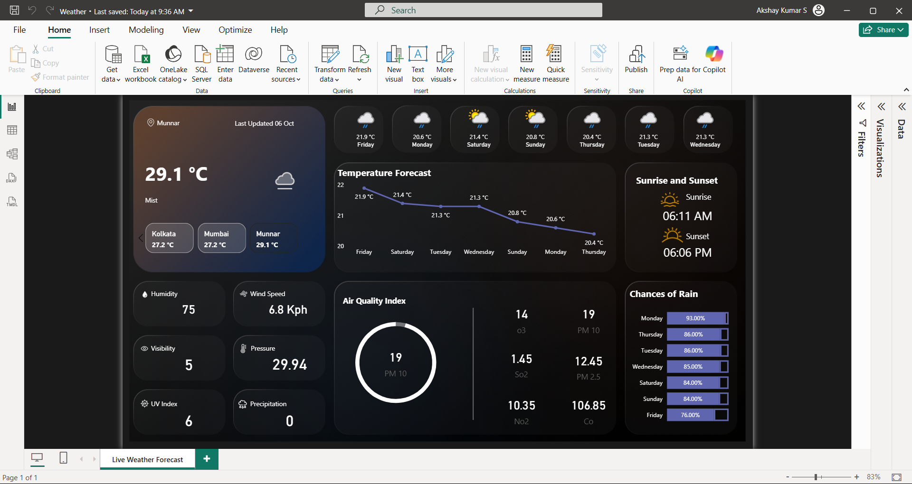

# 🌦️ Live Weather Forecast Dashboard (Power BI)

This project is an **interactive weather dashboard** built in **Power BI**, powered by live data from the [WeatherAPI](http://api.weatherapi.com/v1/forecast.json). It provides real-time insights such as temperature, forecasts, air quality, sunrise/sunset times, and precipitation chances for multiple cities.

---

## 📊 Dashboard Features

* **Current Weather Overview** – Displays live temperature, humidity, wind speed, pressure, and visibility.
* **City Comparison** – Quickly switch between multiple cities (e.g., Bangalore, Chennai, Hyderabad).
* **7-Day Temperature Forecast** – Line chart showing upcoming temperature trends.
* **Air Quality Index** – Gauge visual showing AQI and pollutant levels (PM10, PM2.5, SO2, NO2, etc.).
* **Sunrise & Sunset Times** – Dynamic card showing daily sun cycle.
* **Chances of Rain** – Bar chart visualizing precipitation probability across the week.
* **UV Index & Precipitation** – Additional weather metrics included for deeper insights.

---

## 🛠️ Tools & Technologies

* **Power BI Desktop** – Dashboard design & visualization.
* **WeatherAPI** – Real-time weather & forecast data source.
* **Power Query** – API connection and data transformation.
* **DAX** – Custom calculations and measures.

---

## 📂 Project Files

* `Weather.pbix` → Power BI dashboard file.
* `screenshots/` → Sample screenshots of the dashboard.
* `README.md` → Project documentation (this file).

---

## 🚀 How to Use

1. Download the `.pbix` file from this repo.
2. Open it in **Power BI Desktop (Free)**.
3. Replace the API key in **Power Query** with your own key from [WeatherAPI](https://www.weatherapi.com/).
4. Refresh the data to get **live weather updates**.

---

## 📌 Skills Highlighted

* Power BI Dashboard Design
* Data Cleaning & Transformation (Power Query)
* API Integration in Power BI
* Data Visualization (Cards, Line Chart, Bar Chart, Gauge Chart)
* DAX for Custom Calculations

---

## 📸 Dashboard Preview

*(Add screenshots of your dashboard here)*
Example:

---

## 🌟 Future Improvements

* Adding more cities dynamically via API.
* Integrating historical data for trend analysis.
* Publishing the dashboard to Power BI Service for public access.

---

## 👤 Author

**Akshay Kumar S**
📧 [akshaysubramanian064@gmail.com] | 💼 [www.linkedin.com/in/akshay-kumar-212002ak]

---
